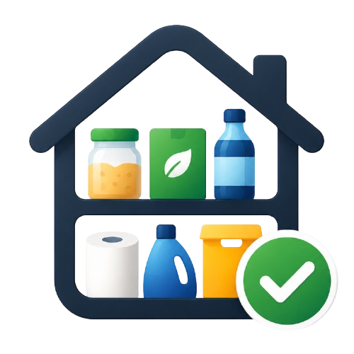

<p align="center">
  
</p>

<h1 align="center">Home Inventory</h1>

<p align="center">
  Controle de estoque doméstico com a sua própria planilha do Google Sheets como banco de dados.
</p>

Mantenha o inventário da casa (despensa, geladeira, banheiro, limpeza...) atualizado
em segundos. A lista de compras é gerada automaticamente a partir dos itens abaixo
do mínimo — sem servidor próprio, sem mensalidade, sem seus dados em um banco de
terceiros: tudo fica na planilha do seu próprio Google Drive.

## Funcionalidades

- **Inventário tátil** — busca, filtros por categoria e favoritos, stepper de
  quantidade com resposta instantânea (otimista, sincroniza em segundo plano).
- **Lista de compras automática** — qualquer item com quantidade abaixo do mínimo
  entra na lista; marque como comprado com um gesto de arrastar.
- **Scanner de código de barras** — aponte a câmera para um produto (EAN-13/UPC-A)
  e o app tenta preencher nome, marca e categoria automaticamente via
  [Open Food Facts](https://world.openfoodfacts.org/).
- **Categorias e locais customizáveis** — organize por onde o produto fica em casa.
- **Tema claro/escuro/sistema.**
- **Login com Google obrigatório** — cada usuário tem sua própria planilha,
  criada automaticamente no primeiro acesso.

## Stack

- React 19 + TypeScript + Vite
- React Router v7 (SPA, client-side)
- TanStack Query (com cache persistido em `localStorage`)
- Zustand (autenticação e planilha ativa)
- Tailwind CSS v4 + shadcn/ui (Radix)
- Google Identity Services (OAuth implícito) + Google Sheets API v4 + Google Drive API v3
- [`barcode-detector`](https://www.npmjs.com/package/barcode-detector) (ponyfill via zxing-wasm) para o scanner

## Arquitetura

Frontend-only SPA — o backend é a planilha Google Sheets do próprio usuário. Não há
servidor próprio, não há modo mock/offline: login com Google é obrigatório.

```
presentation → hooks → domain ← infrastructure
                    ↑
             application (repositoryProvider)
```

- `application/repositoryProvider.ts` é o único ponto de decisão: resolve o
  `spreadsheetId` do usuário logado e devolve (com cache) um `GoogleSheetsRepository`.
- Trocar de backend = criar uma nova classe implementando `InventoryRepository` e
  trocar o provider — zero mudanças na UI.

### Arquivos-chave

| Caminho | Papel |
|---|---|
| `src/domain/types.ts` | `Product`, `Category`, `Location` |
| `src/domain/repository.ts` | `InventoryRepository` — contrato único |
| `src/domain/schemas.ts` | Validação/sanitização (Zod) |
| `src/application/repositoryProvider.ts` | Factory com cache do repositório ativo |
| `src/hooks/queries.ts` | Queries e mutações (TanStack Query), incremento de quantidade com debounce |
| `src/services/googleAuth.ts` | OAuth implícito (Google Identity Services) — token só em memória/`sessionStorage` |
| `src/store/authStore.ts`, `spreadsheetStore.ts` | Zustand + persist: usuário logado e `spreadsheetId` por e-mail |
| `src/infrastructure/google/GoogleSheetsRepository.ts` | CRUD contra a Sheets API v4 |
| `src/infrastructure/google/DriveApiClient.ts`, `SheetsInitializer.ts` | Cria/localiza a planilha e a pasta do usuário no Drive |
| `src/infrastructure/openfoodfacts/OpenFoodFactsClient.ts` | Lookup público de metadados por código de barras |
| `src/presentation/components/BarcodeScannerModal.tsx` | Câmera + detecção de código de barras |

### Rotas

| Caminho | Página |
|---|---|
| `/login` | Login com Google |
| `/setup` | Cria/associa a planilha do usuário (roda uma vez, após o primeiro login) |
| `/` | Inventário |
| `/adicionar` | Adicionar produto (com scanner de código de barras) |
| `/buscar` | Busca |
| `/compras` | Lista de compras |
| `/produto/:id` | Detalhe/edição do produto |
| `/configuracoes` | Tema, categorias, locais, conta Google |

### Convenções de dados

- Produtos referenciam categoria/local pelo **nome** (string), não por id — mesmo
  modelo já usado na UI (chips, selects, filtros).
- Quantidade nunca é negativa.
- Incrementos de quantidade (+/-) atualizam o cache local imediatamente e
  sincronizam com a planilha depois de 600ms sem novos toques (debounce) — evita
  gravar a cada clique e estourar a cota da Sheets API.
- Favoritar e mover para o carrinho são mutações otimistas normais (sem debounce),
  já que são toques únicos.

## Rodando localmente

```bash
npm install
npm run dev
```

**Sem `VITE_GOOGLE_CLIENT_ID` o app não funciona** — não há modo mock/offline.
Configure as credenciais do Google antes de rodar (próxima seção).

Outros scripts: `npm run build`, `npm run preview`, `npm run lint`, `npm run format`.
Não há testes automatizados neste projeto.

## Conectando ao Google Sheets

1. Crie (ou reutilize) um projeto no [Google Cloud Console](https://console.cloud.google.com/).
2. Em **APIs e serviços → Biblioteca**, habilite a **Google Sheets API** e a
   **Google Drive API**.
3. Em **APIs e serviços → Tela de consentimento OAuth**, configure o tipo
   **Externo** e adicione seu e-mail em **Usuários de teste** (enquanto o app não
   for verificado pelo Google).
4. Em **APIs e serviços → Credenciais**, crie uma **ID do cliente OAuth** do tipo
   **Aplicativo da Web**, com as origens JavaScript autorizadas:
   - `http://localhost:8080` (desenvolvimento)
   - o domínio de produção, quando fizer o deploy
5. Copie o Client ID gerado para `.env.local`:
   ```env
   VITE_GOOGLE_CLIENT_ID=seu-client-id.apps.googleusercontent.com
   ```
6. `npm run dev`, acesse `http://localhost:8080`, entre com sua conta Google.
   No primeiro acesso, o app cria automaticamente uma planilha **"Home Inventory"**
   dentro de uma pasta **"LealTEK Apps"** no seu Google Drive, com as abas
   `products`, `categories` e `locations` já configuradas.

## Segurança

- Nenhum `client_secret` é usado — o fluxo OAuth implícito do Google Identity
  Services não precisa dele.
- O token de acesso nunca é persistido em `localStorage`: fica em memória e, no
  máximo, espelhado em `sessionStorage` (limpo ao fechar a aba/expirar).
- Escopo mínimo solicitado: `drive.file` (o app só acessa arquivos que ele mesmo
  cria) + `openid email profile` (identificação do usuário).
- Toda entrada de formulário passa por sanitização (remoção de tags HTML e
  caracteres de controle) antes de ser persistida.

## Deploy

Qualquer hospedagem de site estático funciona (o app é 100% client-side). Passos
para Digital Ocean App Platform:

1. Tipo de componente: **Static Site**.
2. Build command: `npm run build`. Output directory: `dist`.
3. Configure a variável de ambiente `VITE_GOOGLE_CLIENT_ID` no painel de build.
4. Ative `catchall_document: index.html` (ou use o `dist/404.html`, gerado
   automaticamente pelo plugin `spa-404` do `vite.config.ts`) para o roteamento
   client-side funcionar em URLs profundas.
5. Volte ao Google Cloud Console e adicione o domínio de produção às **origens
   JavaScript autorizadas** do OAuth Client ID.
